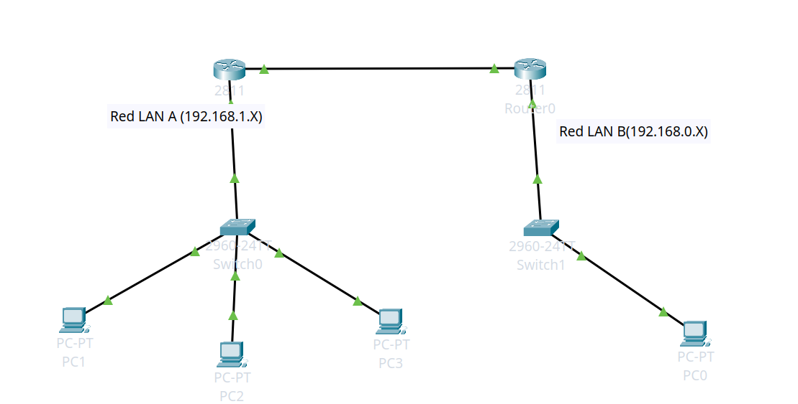
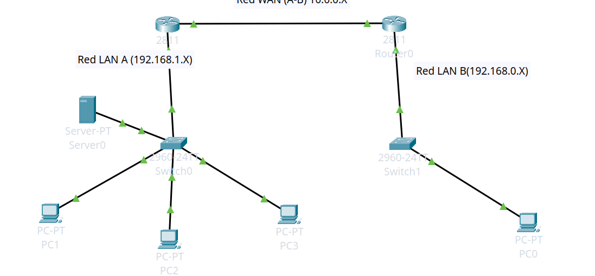

# CPT Notes

## Índice
- [Como crear una red LAN en CPT](#como-crear-una-red-lan-en-cpt)
- [Como crear una red con router (WAN)](#como-crear-una-red-con-router)
- [Como usar DHCP](#como-usar-dhcp)

## Como crear una red LAN en CPT:
Primero crea una red basica usando un switch, y PCs luego conecta las PC al switch usando cables cooper straight-throug
en puertos FastEthernet, (si la pc no tiene ese puerto se añade en la pestaña Fisica de la PC) luego entra a la 
IP configuration de cada una de las PC y asignales su IP en el rango de 192.168.0.x y listo! ahi tienes tu primera
red LAN basica.

## Como crear una red con router
1. Asegúrate de tener tus dos routers con sus Switchs y sus pcs conectadas
2. Asegúrate de tener IPs LAN diferentes en cada una, puedes usar 192.168.1.x y 192.168.0.x para cada una aunque puedes elegir el rango que quieras en .168.x
3. Crea una subred WAN, para ello conecta los dos routers en la interfaz FastEthernet 0/1 usando un cable copper Straigh Through, luego entra a la configuración de ambos y en cada una ejecuta:

```bash
en
conf t
int fa0/1
ip add 10.0.0.1 255.255.255.252 (router A)
no shutdown
ip add 10.0.0.2 255.255.255.252 (router B)
no shutdown
```
Con esto ya tienes la red WAN entre los dos routers, asegúrate de que los triángulos estén en verde, pero aún falta el mapade rutas
4. Crear el IP ROUTE
Acá esto tiene la siguiente estructura: IP y Gateway a llamar y IP WAN a la que solicitarle


Router (A)
```
ip route 192.168.0.0 255.255.255.0 10.0.0.2
```
Router (B)
```
ip route 192.168.1.0 255.255.255.0 10.0.0.1
```


EXTRA: Asegúrate de que la Gateway para la red A sea 192.168.0.1 y la Gateway para la red B sea 192.168.1.1

Basicamente digamos que la red A es choluteca y la red B es Tegucigalpa, viene una persona (PC) de tegucigalpa diciendo que quiere mandarle un paquete a otra persona (PC) en choluteca, pero por si sola no lo puede lograr, por lo que esta personita va a dejar su paquete a la paqueteria (switch) luego la paqueteria se lo entrega al camionero (router) (el cual puede ir hacia afuera de tegucigalpa) luego el camionario viaja hasta choluteca y se encuentra con el camionero de choluteca (router A) y le entrega el paquete, luego el router A le entrega el paquete a la paqueteria de choluteca (switch A) y esa paqueteria le entrega el paquete a la persona en CHoluteca para saberlo, en el paquete esta grabado el Header source y el Dest IP y con eso todos saben a quien pasarselo 

## Como usar DHCP?
Para usar DHCP primero necesitamos entender que es, basicamente es un ciclo DORA como DORA la exploradora jajaja, ok no DORA significa DiscoverOfferRequestAcknowledge y esto es lo que permite que el DHCP funcione
y evitarnos tener que escribir IPs estaticas manualmente, para esto necesitamos una red LAN basica con switch, las PC y un SERVER, ACA lo mas importante sera el servidor

### Entramos a la configuracion del server
Aca tenemos que hacer varios ajustes, primero vamos a configurar el server como tal, para esto primero iremos a desktop y luego a IP confi, aqui vamos a ponerle una IP estatica a nuestro servidor,
OJO AQUI!!!!!!! la IP del servidor debe estar en el rango de la ip LAN, la gateway debe ser la del router (si tienen) el DNS server por ahora en 0.0.0.0
### Configurar DHCP
Aca en el apartado de servicios DHCP vamos a darle a Enabled, luego vamos a configurar la Start IP address aca vamos a poner el rango en que deseamos que nuestro server de las direcciones IP
solo asegurate de que el rango de ip en que lo pondras no vaya a chocar con otra ip ya establecida, es recomendable ponera desde 192.168.1.2 para no chocar con el router, ajusta la mascara de subred
la cual es 255.255.255.0 y tambien pon el numero de  dispositivos,
### IMPORTANTE!!! DARLE A SAVE
### Cliente
En cada una de las PC vamos a ir desktop, run command y ahi vamos a escribir estos dos comandos
```
ipconfig /release
ipconfig /renew
```
Y listo!!


